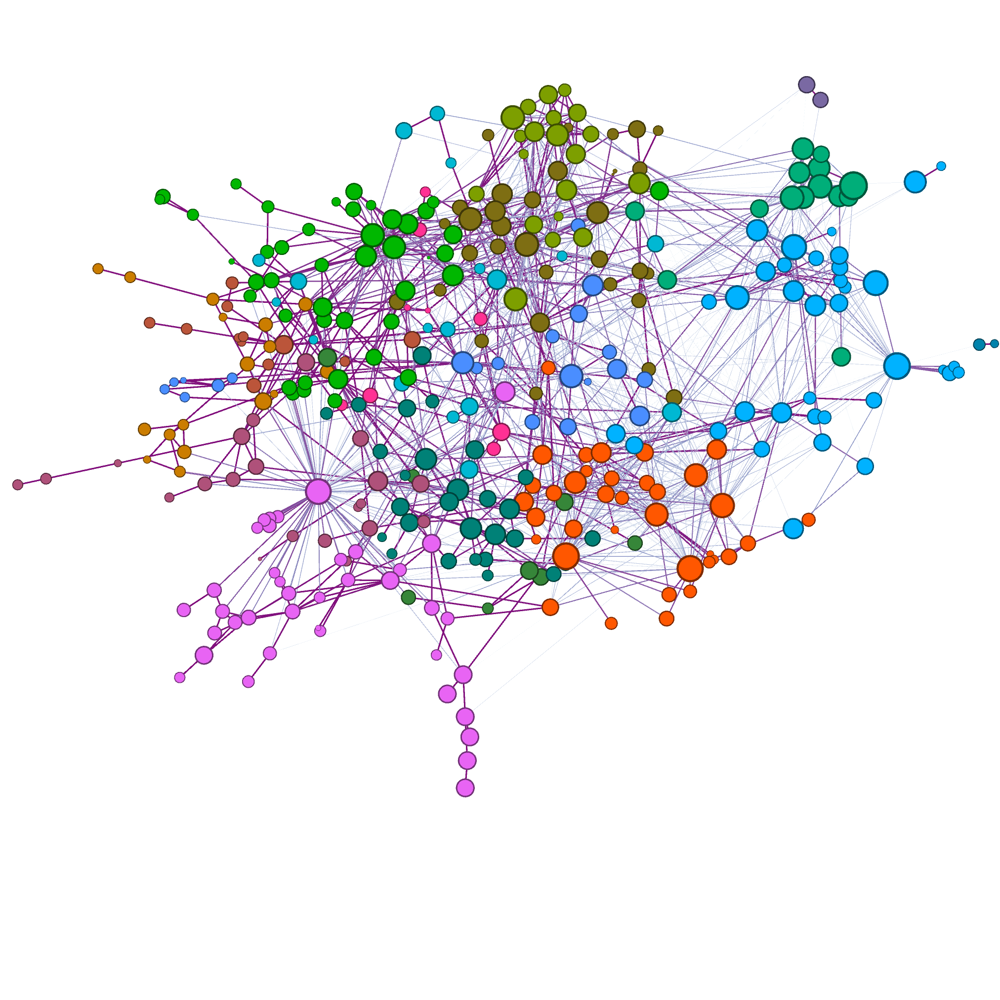
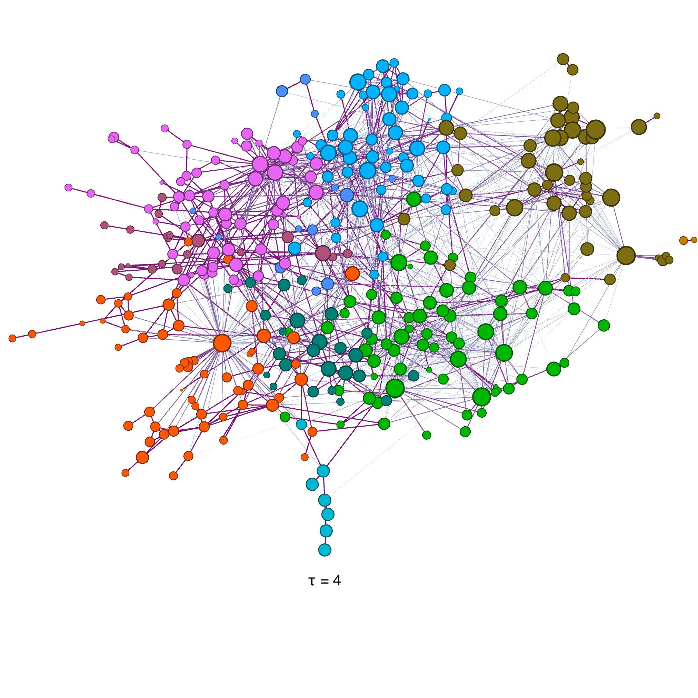

# Annex
\label{Annex}

## Skill-relatedness networks using the "connection" algorithm

The skill-relatedness matrices are used  to construct an undirected weighted network. This network can now be used 
to identify industry clusters.

In this section annex the skill-relatedness networks built using the **connection** algorithm for the periods of 1997-2008 and 
 2009-2018 are discussed. 

### Network descriptors 

The top 5 industry nodes by degree, centrality and betweeness are shown in Tables 12 and 13 for both time periods. As expected
in each time period there is a consistency in which are the nodes ranking higher in these metrics. 

Table 12. Top five nodes for the network of the period from 1997 to 2008 using the **connection** algorithm in different
degrees and centrality metrics.

|Degree |	Weighted Degree	| Centrality |	Betweeness |
|-------|-------------------|------------|-------------|
|Labour recruitment and provision of personnel	|Management activities of other non-financial holding companies	| Labour recruitment and provision of personnel |Labour recruitment and provision of personnel|
|Management activities of other non-financial holding companies |	Manufacture of other plastic products |Management activities of other non-financial holding companies|	Management activities of other non-financial holding companies  |
|Other business activities not elsewhere classified|Wholesale of photographic goods|Other business activities not elsewhere classified|	Freight transport by road n.e.c.|
|Retail sale |	Manufacture of electronic instruments and appliances for measuring, checking, testing, navigating and other purposes, except industrial process control equipment|Business and management consultancy activities, n.e.c.|Business and management consultancy activities, n.e.c.|
|Freight transport by road n.e.c.|	Retail Sale	|Other software consultancy and supply|Other business activities not elsewhere classified |
|-------|-------------------|------------|-------------|

Table 13. Top five nodes for the network of the period from 2009 to 2018 using the **connections** algorithm in different
degrees and centrality metrics.

|Degree |	Weighted Degree	| Centrality |	Betweeness |
|-------|-------------------|------------|-------------|
|Temporary employment agencies|	Temporary employment agencies|	Temporary employment agencies|	Temporary employment agencies|
|Food, beverages, tobacco mainly|	Business, other management|	Office admin, business support|	Primary|
|Beverage serving|	Engineering/tech consultancy|	Beverage serving	Food, beverages, tobacco| mainly|
|Restaurants, mobile food service|	Office admin, business support|	Food, beverages, tobacco mainly|	Office admin, business support|
|Office admin, business support|	Head office activities|	Restaurants, mobile food service|	Engineering/tech consultancy|
|-------|-------------------|------------|-------------|

The UK skill-relatedness networks are illustrated in Figures \ref{Network20092018_conn} and \ref{Network19972008_conn}.
In these figures each node represents an industry and each edge its skill-relatedness index. The node layout is
built with a spring algorithm called "Force Atlas" in Gephi. In both figures, labels indicating the general
position of different industries are shown, and is possible to observe that industries that are more skill-related
tend to be position closer toguether (eg. government, services and finance tend to be in one side of the network, whilst
manufacture related industries is in the other side).

In figure \ref{Network20092018_conn} the size of each node represents the total employment in each industry during 2015, 
which is obtained using the open access Business Register and Employment Survey (BRES) provided by the [Nomis](https://www.nomisweb.co.uk/query/construct/summary.asp?mode=construct&version=0&dataset=189)
 service from the Office of National Stistics (ONS).

[Network20092018_conn]: figures/network_2009_2018_conns.png
![Visualisation of the skill-relatedness network for the United Kingdom using the **connection** algorithm in the period from
2009 to 2018. Each node represents a 4-digit industry and each edge the skill-relatedness between the corresponding industry pair. Nodes are sized by the total
employment size in the United Kingdom during 2015 and coloured according to their industry cluster detected according to the Markov
Stability Algorithm (t=1). Only positive edges are shown. The node layout is based on a spring
algorithm called ‘Force Atlas’ in Gephi. \label{Network20092018}][Network20092018_conn]

[Network19972008_conn]: figures/network_1997_2008_conns.png
![Visualisation of the skill-relatedness network for the United Kingdom using the **connection** algorithm n the period from 1997
to 2008. Each node represents a 4-digit industry and each edge the skill-relatedness between the corresponding industry pair. Nodes are sized by the total
employment size in the United Kingdom during 2015 and coloured according to their industry cluster detected according to the Louvain algorithm implemented
in Gephi. Only positive edges are shown. The node layout is based on a spring
algorithm called ‘Force Atlas’ in Gephi. \label{Network19972008}][Network19972008_conn]
        

## Skill-related industry clusters for the 2009 - 2018 period

Similarly to the the results shown in \ref{CommunitySection}, the Markov Stability Algorithm[@MarkovTime] its used as 
community detection algorithm to subdivide industries into groups with high skill-relatedness. 
 
Figure \ref{MarkovTimeconnection} shows  the number of communities, the stability function and the variance in information obtained when 
running the Markov Stability algorithm on the **connections** network for the 2009-2018 period for different time resolution
parameters. The information variation figure shows 
that there are several Markov times where there are local minimum, where are relative stable partition is found (eg. times 3, 7, 15). 
   
    
[MarkovTimeconnection]: figures/MarkovTimeFigureFlows2009_2018_conns.jpg
![A graph showing the number of communities and the variation of information of the node partition generated
by the Markov Stability Algorithm at different Markov times. \label{MarkovTimeconnection}][MarkovTimeconnection]

The different node partitions obtained at different markov time resolutions are
used to understand the nested structure of the UK labour market, this is shown in Figure \ref{CommunityEvolution}.

Following the same pattern as the results using the **flows** network, at first, most clusters contain very similar industries and is generally compatible with 
their nominal industriasl classification. In the next step, the government and services industries join together into a larger group and finance, law, technology
and other business activities are now part of another group, whilst in the other
hand heavy manufacture (chemicals, plastics, metals), construction and mining become another larger group. In the final step, the network is splits in 4 parts:
one large groupcontains services, government and general business activities and another covering the manufacturing industries, a third small
 group is representing agriculture activities plus a final group with the transportation industries. 

 

{width=50%}
{width=50%}
{width=50%}
{width=50%}
\begin{figure}[!h]
\caption{Visualisation of the skill-relatedness network for the United Kingdom using the **connection** algorithm in the period from
2009 to 2018. The communities are coloured according to their industry cluster detected according to the Markov
Stability Algorithm which is estimated at different resolutions (t=1, 4, 25 and 50).  Each node represents a 4-digit industry and each 
edge the skill-relatedness between the corresponding industry pair. Nodes are sized by the total
employment size in the United Kingdom during 2015. Only positive edges are shown. The node layout is based on a spring
algorithm called ‘Force Atlas’ in Gephi.}
\label{CommunityEvolution_conn}
\end{figure}

    