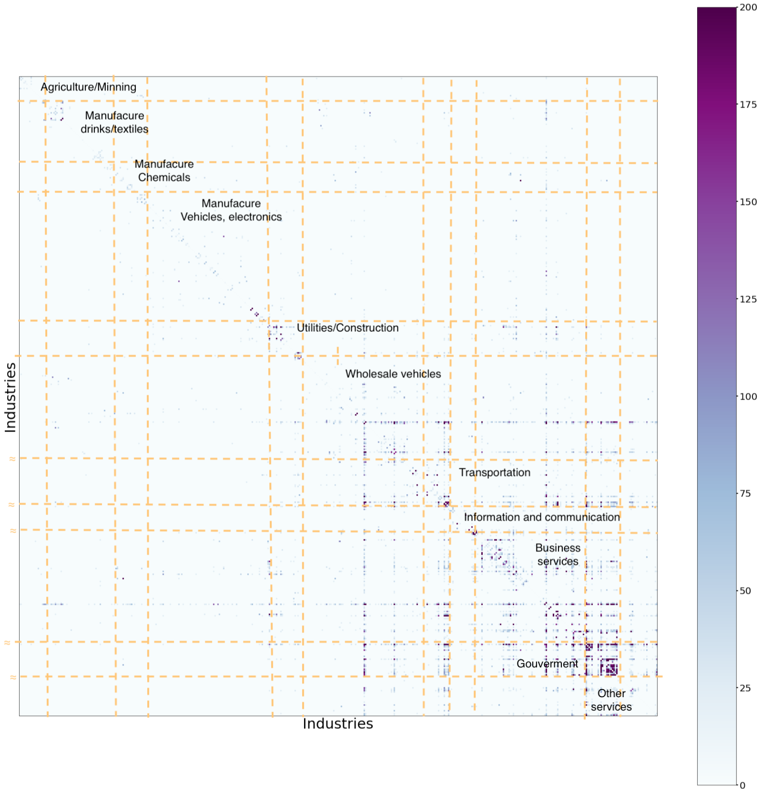
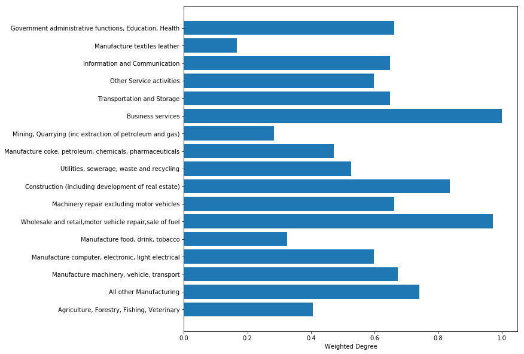
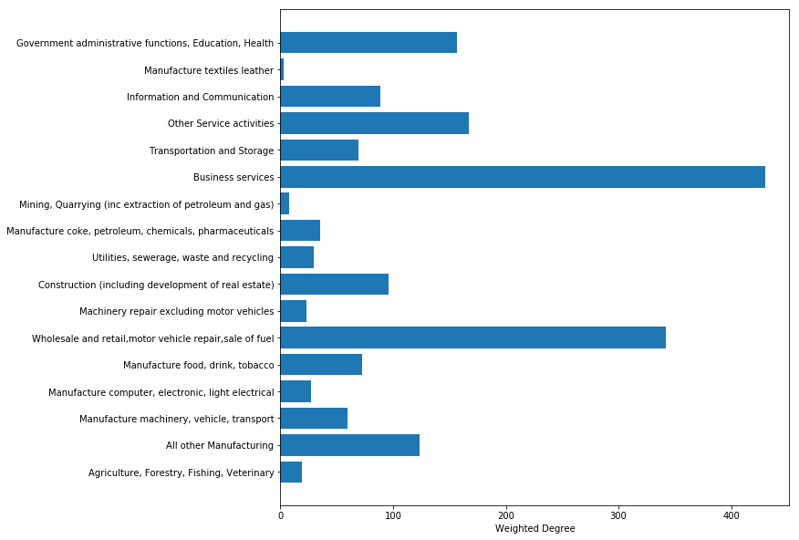
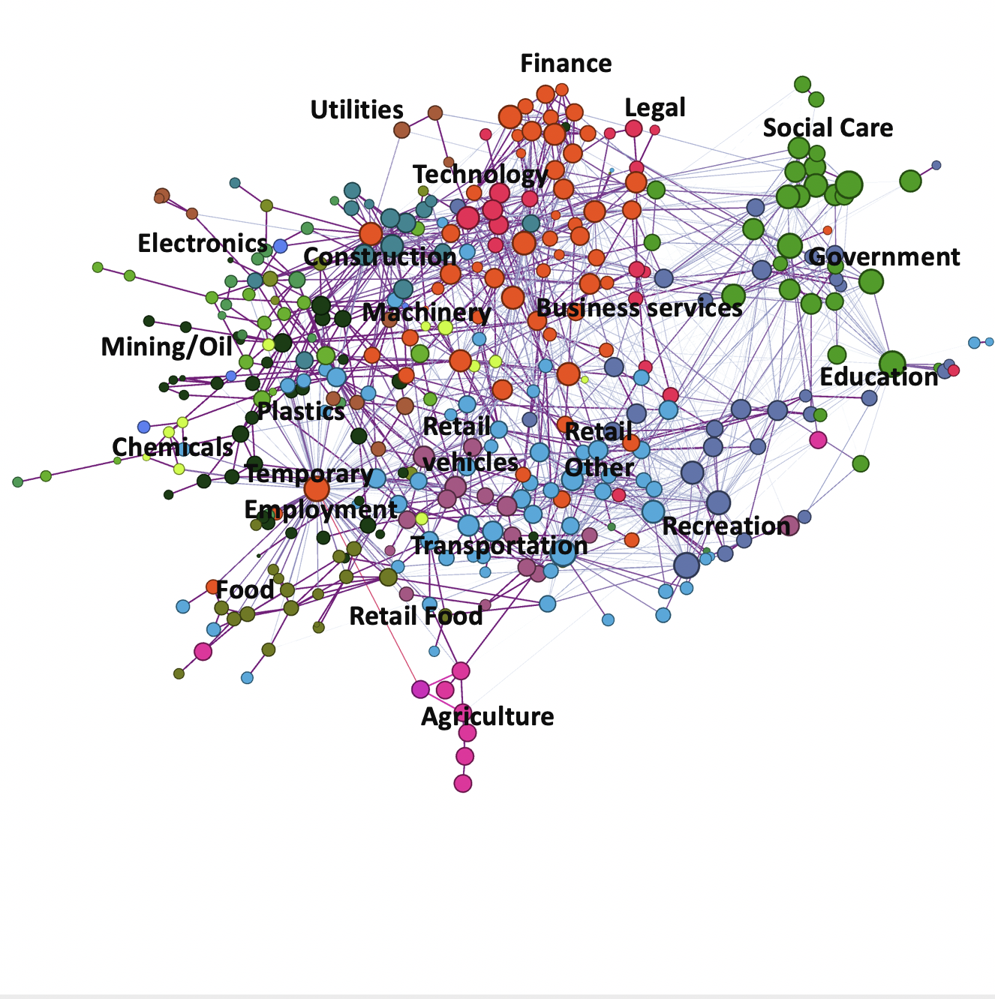
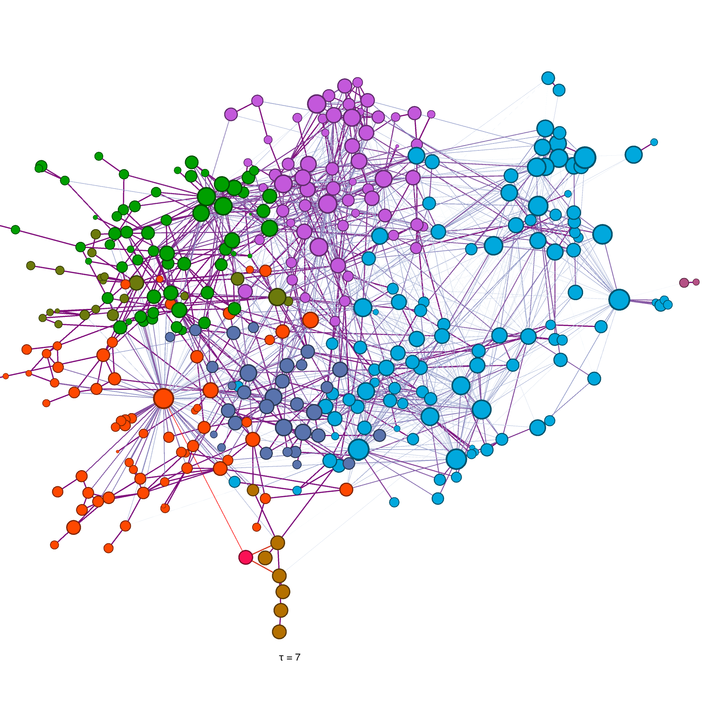
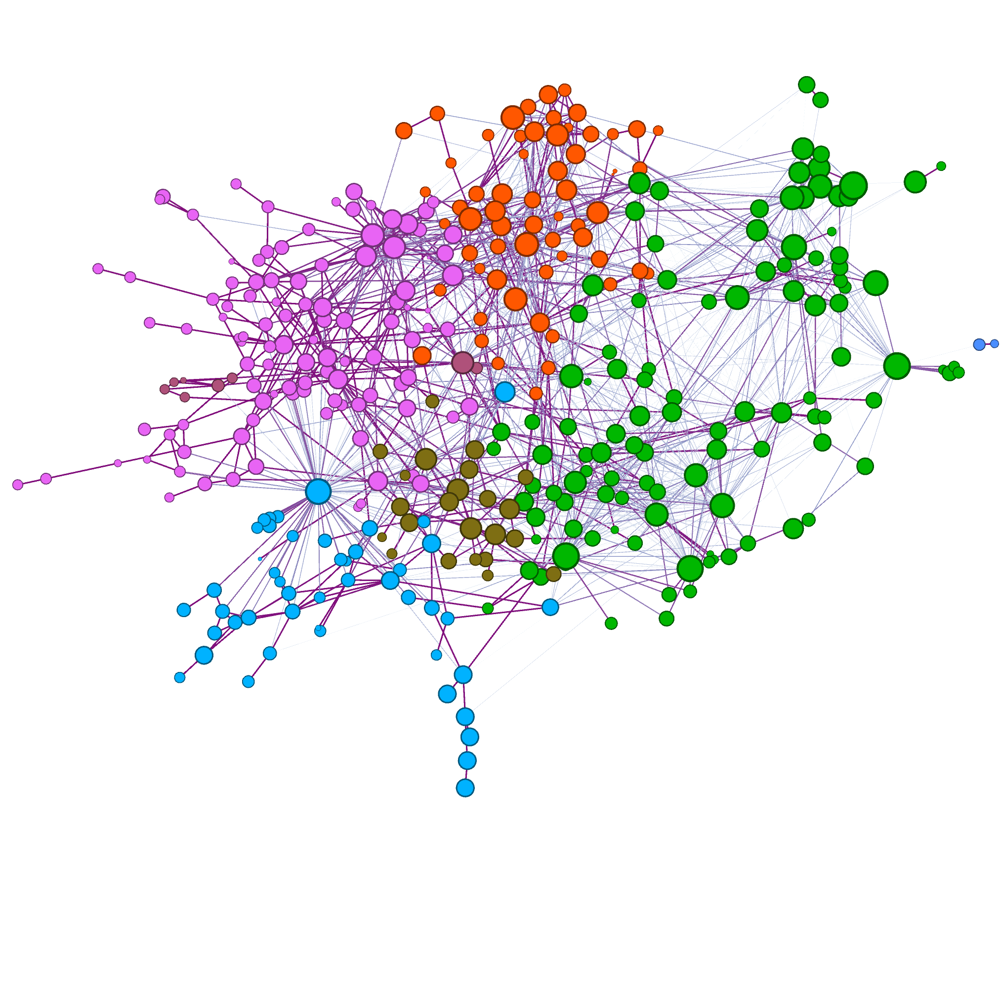
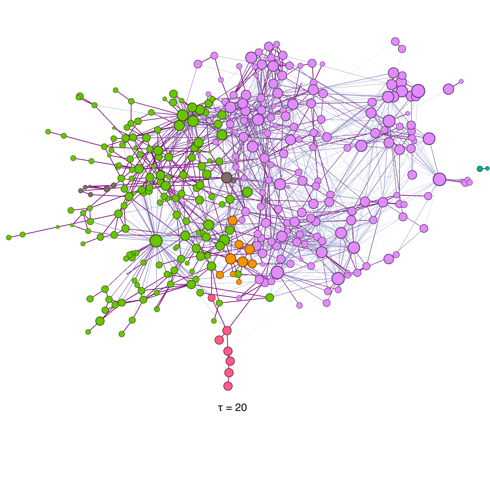

# Introduction 

This report describes the procedure of constructing skill-relatedness matrices for
the United Kingdom (UK). Skill-relatedness aims to provide a quantitative estimate of similarities between two industries
 in terms of their human capital requirements [@GermanyMatricesReport].
 
The matrices are built over two periods of time (1997-2008 and 2009-2018), using two standard industrial classifications codes.  For each period of time, a sample of employee jobs is taken from HM Revenue & Customs PAYE records, and
 the employee transitions between industries are recorded. These transitions are then used to build the skill-relatedness matrices.
 
The structure of this report is as follows: the dataset used to build the skill-relatedness matrices is described in 
Section \ref{data}. Then, the method to measure the transitions between industries is described in Section \ref{method}.
A statistical procedure is applied to convert the observed labor transitions to a metric that reflects the skill relatedness
between the industries, this is described in Section \ref{SR}. Finally, in Section \ref{results} the resulting matrices are
described and a preliminary network analysis is shown.

# Data
\label{data}

The skill-relatedness matrices are based on the Annual Survey of Hours and Earnings dataset (ASHE), which 
is the most comprehensive source of earnings information in the United Kingdom. This dataset contains 
anonymised demographic and employment information of 1% of the total employee jobs in the HM Revenue & Customs (HMRC) Pay
As You Earn (PAYE) records, covering the years between 1997 to 2018 [@ASHE]. 

The sample is drawn in such a way that 
many of the same individuals are included from year to year, allowing a longitudinal analysis of the data. This is fundamental
for the construction of the skill-relatedness matrices.

Some of the available information in the dataset is the workers’s wage, occupation, 
employment status, industry classification (5-digit level), location of their work establishment, etc. 
From 1997 to 2008 the data uses the Standard Industrial Classification from 2003 (SIC2003) whilst in the period from 2009 to 2018 
the industrial classification has been updated to the 2007 version (SIC2007). As there is not a trivial concordance method 
for converting these codes, in the process of building the matrices the samples had to be treated separately into two parts, 
depending on the industrial classification available at the year of collection.

The ASHE dataset contains sensitive personal information, therefore is restricted to be used in the [UK Data Service](https://www.ukdataservice.ac.uk/) (UKDS) Secure
Lab. Any results shown here have been exported from this secure environment and approved by the UKDS data managers.
   
## Data selection
 \label{dataselection}
As the size of the ASHE dataset is small (only 1%), the selection cut of the workers that are going to be used in the 
measurement of job transitions is kept to the minimum. The selection criteria are the following:

* Between 16 and 65 years of age;
* Without missing information on industry, occupation, region of work, gender or age.

## Data description

TODO: ADD INFORMATION ABOUT DATA: NUMBER OF WORKERS, ASHE/BRES RATIO, ETC.

# Method
 \label{method}
 
 
 
The job transitions are measured in a per-worker basis and are defined as any two jobs observed for a particular worker in
a determined period of time.  

For each worker found in the ASHE dataset that passes the selection
steps described in Section \ref{dataselection}, a table of all the jobs recorded is extracted. This *job table* contains 
information of each job found for that individual: year of employment, the industry classification of each job and the 
post code of the work establishment associated to that job. 

 Table 1. An example of a *job table* for a particular individual with anonymised id = 1.
        
| Id | Year | Industrial Classification    | Work Post code       |
|----|------|----------------|-------------|
| 1  | 2009 | IndustryA              | A1          |
| 1  | 2010 | IndustryA              | A1          |
| 1  | 2010 | IndustryB              | B1          |
| 1  | 2011 | IndustryC              | C1          |
| 1  | 2013 | IndustryD              | D1          |
| 1  | 2013 | IndustryD              | D2          |

Using this table, two approaches can be followed to measure the actual job transition. In this section, the method of **connections**
is explained next. An alternative method for estimating the transitions so-called the **flows** method is described in section \ref{flows} of
 the Annex. 
 

## Transitions as "connections"
\label{connections}
Define a **connection** as all possible unique combinations found in the *job table* for that individual worker, that comply with the following rules:

   * A valid **connection** cannot be separated by more than 2 years.
   * A "**connection**" cannot happen within the same job in 2 different years (if the industry code and the work postcode,
    it is assumed that it is the same job).

In the example case of Table 1, the **connections** will be the following:

| Id    | Connection | Year Difference    |Work  Postcodes   |
|-------|------------|----------|---------|
| 1     | IndustryA - IndustryB        |2009-2010 | A1-B1   | 
| 1     | IndustryA - IndustryC        |2009-2011 | A1-C1   | 
| 1     | IndustryB - IndustryC        |2010-2011 | B1-C1   | 
| 1     | IndustryC - IndustryD        |2011-2013 | C1-D1   | 
| 1     | IndustryC - IndustryD        |2011-2013 | C1-D2   | 
| 1     | IndustryD - IndustryD        |2013-2013 | D1-D2   | 
        
        
The **connections** are undirected intrinsically (eg. a connection from IndustryA - IndustryB is the same as the connection
from IndustryB - IndustryA). In the data, both cases can be found, therefore, a further symmetrical step needs to be applied:

$(IndustryA - IndustryB)_{unidirected}$ =   #(IndustryA - IndustryB) + #(IndustryB - IndustryA)

## Result: a matrix of transition counts
\label{countmatrices_flows}

For each time period (1997-2008 and 2009-2018) and worker observed in the ASHE dataset, the transitions are obtained with the process explained above.
Then, industry classifications are aggregated into a 4-digit code and all transitions tables are added into a single matrix.

The total number of transitions observed from 1997 to 2018 for the **connection** algorithms are shown in Table 2. An interesting observation 
shown in these tables is that the transitions 
are dominated by female workers (number of transition of female workers is X times larger than the male workers on average).

TODO: WRITE OBSERVATION ABOUT THE TABLES ONCE THEY ARE OUT OF THE SECURE LAB.

Table 2. Number of labour transitions observed between 4-digit industries every year from 1997 to 2018 in the ASHE dataset using the **connections**
algorithm. Counts are presented by gender, region and total values. 
        
| Year | Total workers observed | Number Female Transitions | Number Male Transitions | N. Regions |Total transitions observed |
|------|------------------------|---------------------------|-------------------------|------------|---------------------------|
| X    |                      X |                     X     |               X         |            |                           |

               
        

For this report, four matrices have been exported from the UKDS Secure Lab. These matrices contain all the
observed transitions between pairs of industries (including transitions within the same industry), with at least 10 counts. Some general characteristics of
these matrices are the following:

* For the period of 2009-2018 the resulting skill relatedness matrix contain a total of 5141 individual transitions between 445 industries in the 
**connections** algorithms (representing 2.6% of non null values on the adjacency matrix). These results include transitions within the same industry.

* For the period of 1997-2008 the resulting skill relatedness matrix contain a total of 6947 individual directed transitions between 497 industries in the 
 **connections** algorithms (representing 2.8% of non null values on the adjacency matrix). These results include transitions within the same industry.

As the ASHE dataset represents only 1% of the total employee jobs in the HMRC PAYE records, the resulting transition matrices are low in the
observation count (eg. 80% of the transitions between different industries have less than 35 counts). This can be observed in the
distribution of counts for case of the **connections** algorithm for Figure \ref{CountsFlows} (for illustration purposes the 'Count' axis in this figure 
has been cut at 200, around 2.6% of the entries have more than 200 Counts and are not shown, the counts are the ones obtained before the symmetrisation
step explained in \ref{connections}).

[CountsFlows]: figures/CountsIndustriesBetweenTransitions.png
![Distribution of the observed transitions between industries in the period from 2009 to 2018 and using the connection algorithm (the counts are the ones obtained before the
symmetrisation step explained in \ref{connections}, this figure does not include transitions between the same industry).  \label{CountsFlows}][CountsFlows]

In order to not overload this report, all results associated to the **flows** algorithm or the period of time between 1997-2008 are 
presented in the Annex \ref{annex}.

# Statistical method
\label{SR} 

The resulting matrices described in Section \ref{countmatrices_flows} contain the raw counts of transitions observed between pairs
industries. In order to infer how related two industries are in terms of skill- relatedness, a statistical procedure is
applied to the matrices. The mathematical details of this method are found in [@GermanyMatricesReport], in this section
a high level general description of the method is presented.

First, the raw transition count matrix is
compared to a null model where the transitions occur at random. In particular, a ratio ($SR$) is calculated
between the observed transitions and the ones expected in the null model.  Values of the $SR$ ratio between 0 and 1 
show that the observed transitions are below the expected values on random transitions, whereas values from 1 to infinity 
indicate that observed transition are more than the ones expected in the null model. 

One disadvantage of the ($SR$) metric is that it has a highly skewed distribution to high values, to deal with this 
problem the the metric is symmetrised around 0, for a final weight variable $SR_{sym}$. 

The adjacency matrix for the UK skill-relatedness network constructed with the **connections**  algorithm is
shown in Figure \ref{Adjacency2009_2018}. The matrices are sorted by their 4-digit classification code, and only
entries with $SR_{sym}$ weight values higher than zero are kept (leaving the matrix with 1.7% of non-zero entries). As expected, the matrix is sparse and clusters of values are observed 
near the diagonals, showing that there is a high degree of skill-relatedness between industries in similar sectors.

{width=50%}
{width=50%}
\begin{figure}[!h]
\caption{The adjacency matrix of the skill-relatedness network of the period from 2009 to 2018. The matrix built with the
 the $SR_{sym}$ variable is shown on the left.The matrix only contains entries with 
only positive $SR_{sym}$ weight values.
 The figure on the right show the adjacency matrix built with the 'Counts' variable on the right (in order to be able to observe the 
 low count values the figure colour axis is capped at 200). No cut is applied in this matrix.}
\label{Adjacency2009_2018}
\end{figure}

# Skill relatedness networks
\label{results}

The top 20 transitions based on the number of counts observed in the period of 2009 to 2018 are shown in Table 3. As shown in these tables,
industries with higher number of transitions belong to the education and health sectors. This is expected ad these industries are the
ones with highest employment in the UK. 

The top 20 transitions with top $SR_{sym}$  weights observed in both periods of interest are shown in Tables 4.
As seen in these tables, the highest weighted transitions have low observation counts, most of them around the 10 counts limit. 

Table 3. Top 20 transitions observed in the ASHE dataset in the period of 2009 to 2018 for the **connections**
algorithm, sorted by undirected count observations.  In this table, the transitions counts are undirected
(have been symmetrised according to \ref{connections}).

| Industry                          |   Industry                      | Total Counts | $SR_{sym}$    |
|-----------------------------------|---------------------------------------|--------|----------|
| Primary                           | General secondary                     | 4623   | 0.67 |
| General public administration     | Primary                               | 4619   | 0.57 |
| Other human health activities     | Hospital activities                   | 3579   | 0.657 |
| Temporary employment agencies     | Hospital activities                   | 2158   | 0.17 |
| Regulation business efficient ops | Compulsory social security activities | 2158   | 0.99 |
| Primary                           | Other non residential social work     | 1759   | 0.29 |
| Other food service                | Event catering                        | 1276   | 0.95  |
| Hospital activities               | Residential nursing care              | 1010   | 0.41|
| Beverage serving                  | Restaurants, mobile food service      | 1009   | 0.61 |
| Restaurants, mobile food service  | Food, beverages, tobacco mainly       | 959    | 0.21 |
| General medical practices         | Hospital activities                   | 899    | 0.62  |
| Child day-care                    | Primary                               | 856    | 0.38 |
| Combined facilities support       | General cleaning of buildings         | 834    | 0.75 |
| Residential nursing care          | Elderly, disabled                     | 785    | 0.82   |
| Elderly, disabled                 | Residential nursing care              | 761    | 0.77 |
| Elderly, disabled                 | Other residential care activities     | 745    | 0.81 |
| Electricity production            | Electricity distribution              | 719    | 0.99 |
| Temporary employment agencies     | Employment placement agencies         | 712    | 0.73 |
| Health care, education etc        | Other human health activities         | 693    | 0.87 |
| Food, beverages, tobacco mainly   | Clothing                              | 661    | 0.17 |

It is important to have in mind that due to the typical low count of the samples some highly related pair of industries
present in the UK economy can be missing completely in the resulting matrices (i.e. the directed count in the 
pair of industries is 9, not passing statistical disclosure control from the UKDS).

Table 7. Top 20 transitions with highest $SR_{sym}$  weight observed in the ASHE dataset in the period of 2009 to 2018
for both the **connections** algorithm.  In this table, the transitions are undirected.

| Industry                            |   Industry                         | Total counts | $SR_{sym}$    |
|-------------------------------------|------------------------------------|--------|----------|
| Agriculture, animals, raw goods     | Live animals                       | 21     | 0.99 |
| Fibre optic cables                  | Other electronic, electric wires   | 22     | 0.99 |
| Raising of dairy cattle             | Raising of other cattle, buffaloes | 21     | 0.99 |
| Pre-press, pre-media services       | Paper, paperboard                  | 28     | 0.99 |
| Gravel, sand pits; clays, kaolin    | Plaster products for construction  | 35     | 0.99 |
| Military fighting vehicles          | Fabricated metal products          | 46     | 0.99  |
| Other special purpose machinery     | Computers, peripheral equipment    | 27     | 0.99 |
| Wholesale Tobacco products          | Manufacutring tobacco products     | 23     | 0.99 |
| Flat glass manufacture              | Flat glass shaping, processing     | 21     | 0.99  |
| Plastics, rubber machinery          | Other special purpose machinery    | 21     | 0.99 |
| Other taps, valves                  | Fluid power equipment              | 28     | 0.99 |
| Irradiation, electromedical equip   | Electronic, optical equipment      | 21     | 0.99 |
| Light metal packaging               | Plastic packing goods              | 21     | 0.99 |
| Mixed farming                       | Raising of sheep, goats            | 23     | 0.99  |
| Electronic components               | Loaded electronic boards           | 39     | 0.99 |
| Raising of poultry                  | Prepared farm animals feeds        | 26     | 0.99 |
| Soft drinks; waters                 | Fruit, vegetable juice             | 20     | 0.99 |
| Transport equipment nec             | Railways, underground railways     | 35     | 0.99 |
| Non-domestic cooling/ventilation eq | Wiring devices                     | 47     | 0.99 |
| Music, video recordings             | Books                              | 89     | 0.99 |

## Network analysis

The skill-relatedness matrices are used  to construct an undirected weighted network. This network can now be used 
to identify industry clusters.

TODO: WRITE ABOUT CENTRALITY, WEIGHTED DEGREES

Figure \ref{CentralityDegree} shows the weighed degree and Eigencentraliy metrics for the **connections** network in the 2009-2018 time
 period.

{width=50%}
{width=50%}
\begin{figure}[!h]
\caption{Weighed degree (left) and Eigencentraliy metrics for the **connections** network in the 2009-2018 time
 period.}
\label{CentralityDegree}
\end{figure}

The UK skill-relatedness networks is illustrated in Figure \ref{Network20092018_conn_inds}. In this figure each node 
represents an industry and each edge its skill-relatedness $SR_{sym}$ weight. The node layout is
built with a spring algorithm named "Force Atlas" in Gephi.  Labels indicating the general
position of different industries are shown, and it is possible to observe that industries that are more skill-related
tend to be position closer together (eg. government, services and finance tend to be in one side of the network, whilst
manufacture related industries is in the other side).The size of each node represents the total employment in each industry during 2015, 
which is obtained using the open access Business Register and Employment Survey (BRES) provided by the [Nomis](https://www.nomisweb.co.uk/query/construct/summary.asp?mode=construct&version=0&dataset=189)
 service from the Office of National Statistics (ONS) and the colour represent the 1-digit industrial classification.

[Network20092018_conn_inds]: figures/2009_2018_conn_industries.png
![Visualisation of the skill-relatedness network for the United Kingdom using the **connection** algorithm in the period from
2009 to 2018. Each node represents a 4-digit industry and each edge the skill-relatedness between the corresponding industry pair. Nodes are sized by the total
employment size in the United Kingdom during 2015 and coloured according to their industry classification. Only positive edges are shown. The node layout is based on a spring
algorithm called ‘Force Atlas’ in Gephi. \label{Network20092018_conn_inds}][Network20092018_conn_inds]

## Skill-related industry clusters for the 2009 - 2018 period
\label{CommunitySection}

The Markov Stability Algorithm [@MarkovTime] its used as community detection algorithm to subdivide industries
into groups with high skill-relatedness. 

The Markov Stability algorithm uses a dynamical random walk process in order to study the structure of a network,
it has an intrinsic resolution parameter that represents the time a random walker is allowed to wander on the network.
The time resolution parameter allows for the algorithm to produce network partitions at a range of scales 
(from a few large clusters to many well-defined clusters).
 

Figure \ref{Network20092018_conn} shows the skill-relatedness network with nodes coloured according to their industry 
cluster detected according to the Markov Stability Algorithm (t=1). As expected, it is possible to observe the similarity in the clustering of both this network 
and the industry colored network (\ref{Network20092018_conn_inds}).

  

[Network20092018_conn]: figures/network_2009_2018_conns.png
![Visualisation of the skill-relatedness network for the United Kingdom using the **connection** algorithm in the period from
2009 to 2018. Each node represents a 4-digit industry and each edge the skill-relatedness between the corresponding industry pair. Nodes are sized by the total
employment size in the United Kingdom during 2015 and coloured according to their industry cluster detected according to the Markov
Stability Algorithm (t=1). Only positive edges are shown. The node layout is based on a spring
algorithm called ‘Force Atlas’ in Gephi. \label{Network20092018_conn}][Network20092018_conn]

 
  
Figure \ref{MarkovTimeconnection} shows  the number of communities, the stability function and the variance in information obtained when 
running the Markov Stability algorithm on the **connections** network for the 2009-2018 period for different time resolution
parameters. The information variation figure shows 
that there are several Markov times where there are local minimum, where are relative stable partition is found (eg. times 7, 15, 20, highlighted with yellow lines
in the figure). 

[MarkovTimeconnection]: figures/MarkovTimeFigureFlows2009_2008_conns.jpg
![A graph showing the number of communities and the variation of information of the node partition generated
by the Markov Stability Algorithm at different Markov times, times which local minimum in the information variation are highlighted with yellow lines. \label{MarkovTimeconnection}][MarkovTimeconnection]
 
According to the methodology of O’Clery et al. the different node partitions obtained at different markov time resolutions are
used to understand the nested structure of the UK labour market, this is shown in Figure \ref{CommunityEvolution} for markov times 1, 7,
15 and 20. This evolution shows how first, most clusters contain very similar industries and is generally compatible with 
their SIC 2007 classification. In the next step, the government and services industries join together into a larger group and finance, law, technology
and other business activities are now part of another group, whilst in the other
hand heavy manufacture (chemicals, plastics, metals), construction and mining become another larger group. In the final step, the network is splits in 4 parts:
one large group containing services, government and general business activities and another covering the manufacturing industries, a third small
 group is representing agriculture activities plus a final group with the transportation industries. 

{width=50%}
{width=50%}
{width=50%}
{width=50%}
\begin{figure}[!h]
\caption{Visualisation of the skill-relatedness network for the United Kingdom using the \textbf{connection} algorithm in the period from
2009 to 2018. The communities are coloured according to their industry cluster detected according to the Markov
Stability Algorithm which is estimated at different resolutions (t=1, 7, 15 and 20).  Each node represents a 4-digit industry and each 
edge the skill-relatedness between the corresponding industry pair. Nodes are sized by the total
employment size in the United Kingdom during 2015. Only positive edges are shown. The node layout is based on a spring
algorithm called ‘Force Atlas’ in Gephi.}
\label{CommunityEvolution_conn}
\end{figure}

