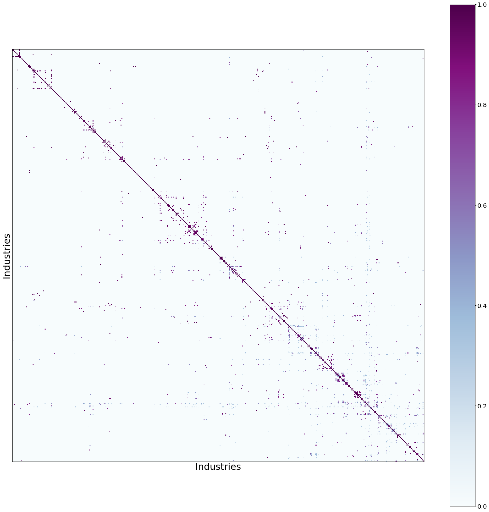
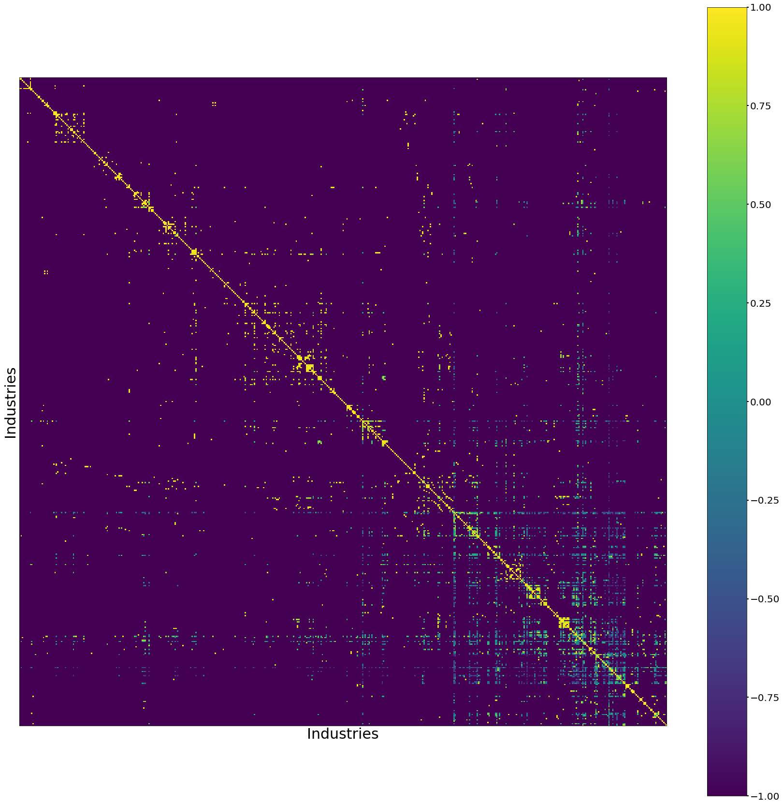
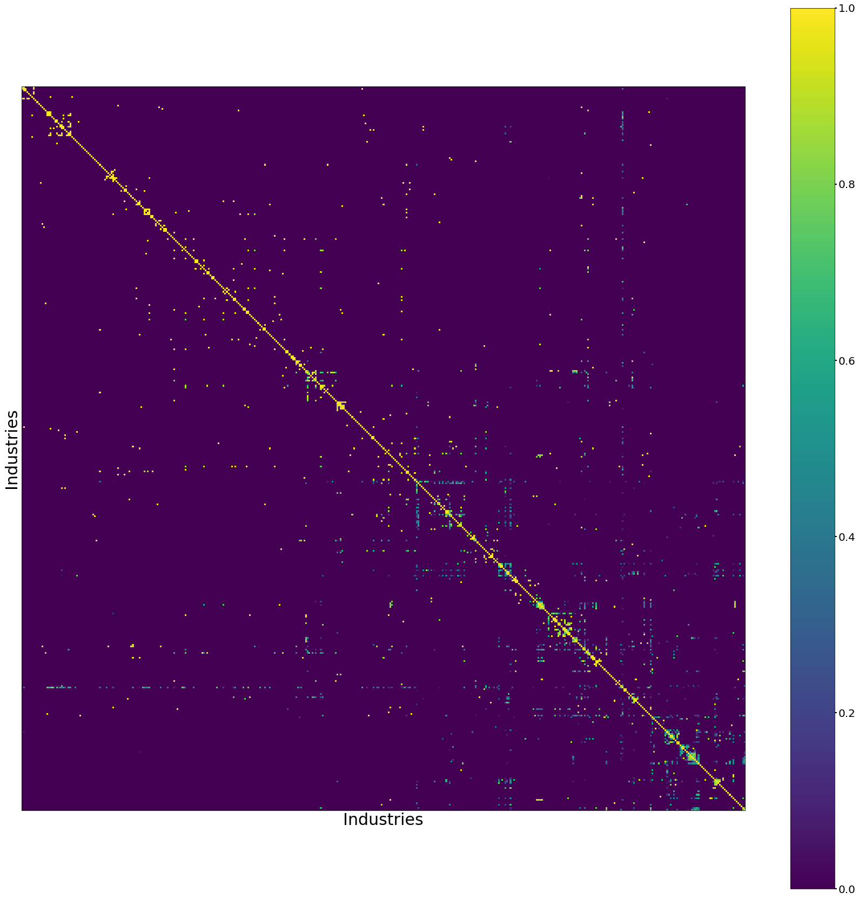
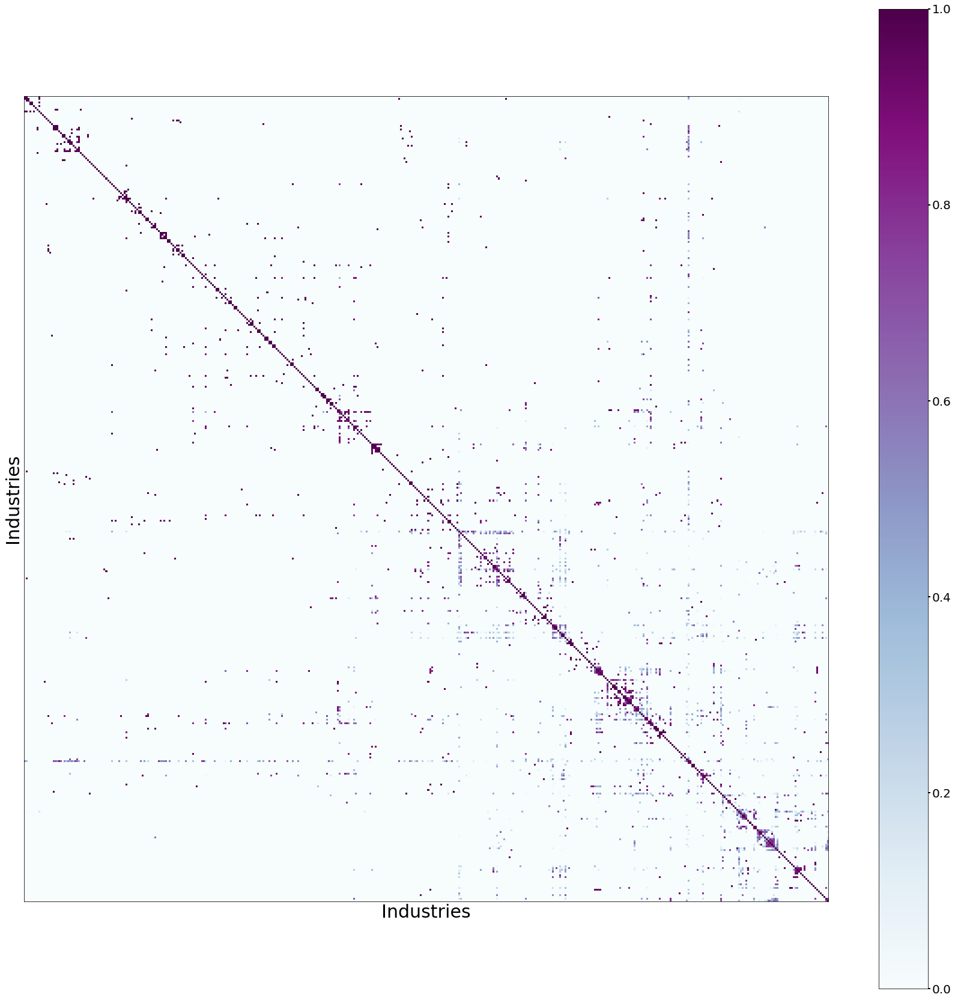
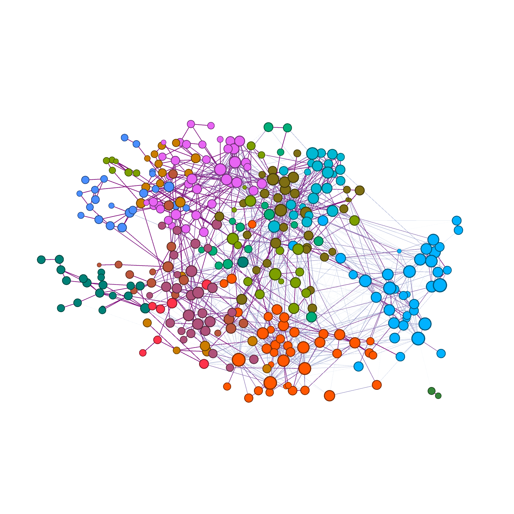
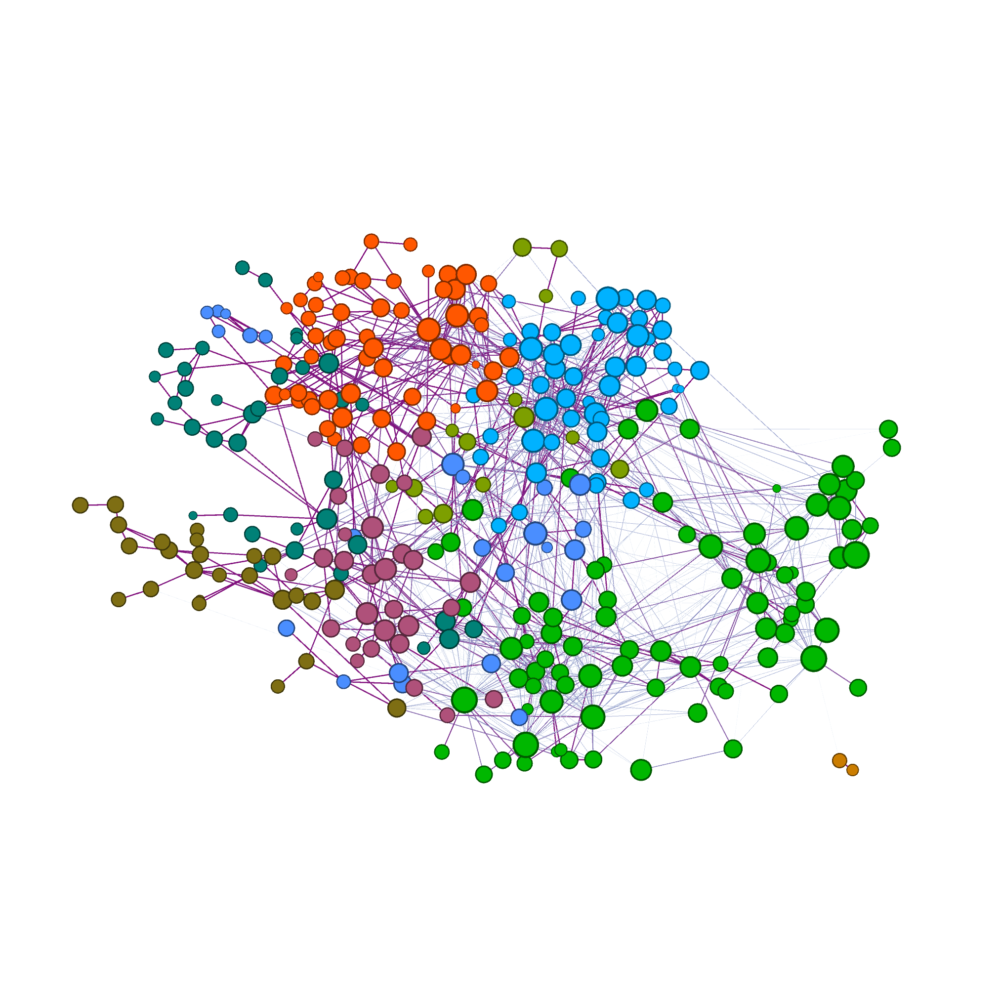
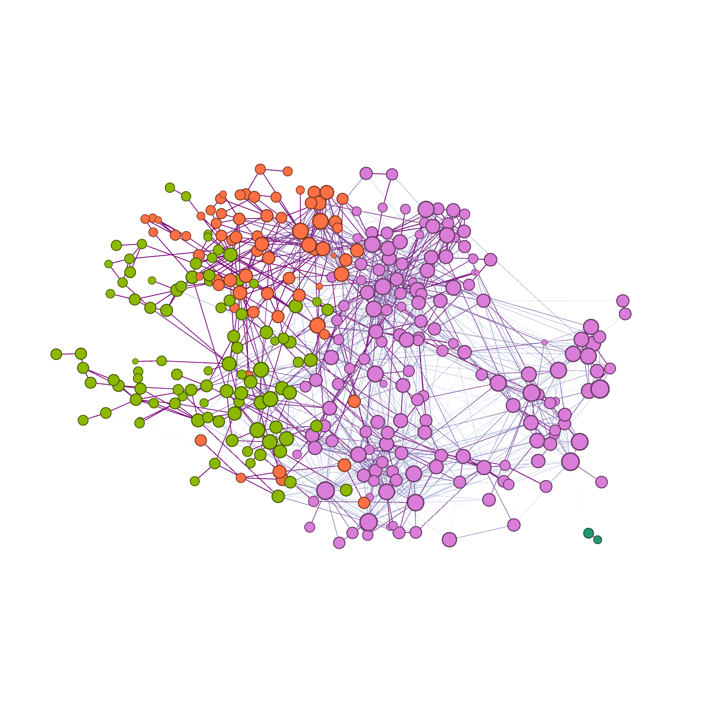
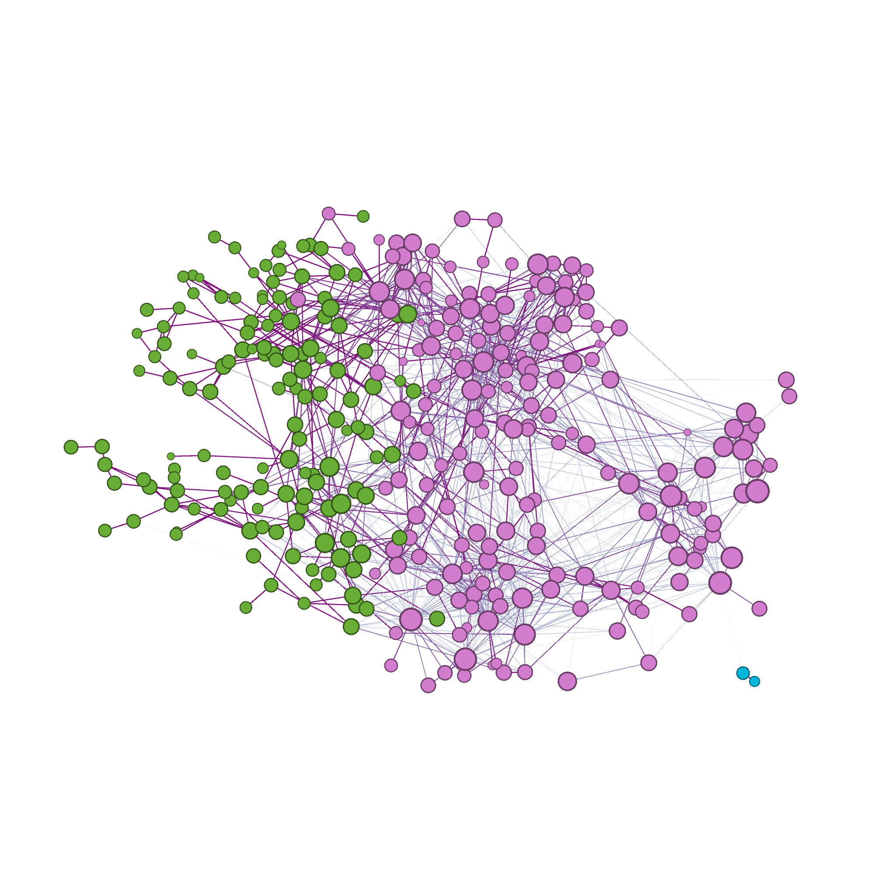

# Introduction 

This report describes the procedure of constructing skill-relatedness matrices for
the United Kingdom. Skill-relatedness aims to provide a quantitative estimate of similarities between two industries
 in terms of their human capital requirements [@GermanyMatricesReport].
 
The matrices are built over two periods of time (1997-2008 and 2009-2018), and two industrial classifications (SI2003 and 
 SIC2007).  For each period of time, a sample of employee jobs is taken from HM Revenue & Customs PAYE records, and
 their transitions between industries are recorded. These transitions are then used to build the skill-relatedness matrices.
 
The structure of this report is as follows. The dataset used to build the skill-relatedness matrices are described in 
section \ref{data}. Then, the method to measure the transitions between industries is described in section \ref{method}.
A statistical procedure is applied to convert the observed labor transitions to a metric that reflect the skill relatedness
between the industries, this is described in section \ref{SR}. Finally, in section \ref{results} the resulting matrices are
described and a preliminary network analysis is shown.

# Data
\label{data}

The skill-relatedness matrices are based on the Annual Survey of Hours and Earnings dataset (ASHE), which is 
is the most comprehensive source of earnings information in the United Kingdom. This dataset contains 
anonymised demographic and employment information of 1% of the total employee jobs in the HM Revenue & Customs (HMRC) Pay
As You Earn (PAYE) records, covering the years between 1997 to 2018[@ASHE]. 

The sample is drawn in such a way that 
many of the same individuals are included from year to year, allowing longitudinal analysis of the data which is fundamental
for the construction of the skill-relatedness matrices.

Some of the available information in the dataset is the workers’s wage, occupation, 
employment status, industry classification (5-digit), location of their work establishment,etc. 
From 1997 to 2008 the data uses the Standard Industrial Classification from 2003 (SIC2003) whilst in the perdiod from 2009 to 2018 
the industrial classification has been updated to the 2007 version (SIC2007). As there is not a trivial concordance method 
for converting these codes,in the process of building the matrices the samples has to be treated separately into two parts, 
depending on the industrial classification avalaible at the year of collections.
   
## Data selection
 \label{dataselection}
As the size of the ASHE dataset is small (only 1%), the selection process of the workers that are going to be used in the 
measurement of job trasitions is kept to the minimum. The selection criteria are the following:

* Between 16 and 65 years of age;
* Without missing information on industry, occupation, region of work, gender or age.

# Method
 \label{method}
 
The job transitions are measured in a per-worker basis. 

For each worker found in the ASHE dataset that passes the selection
steps described in section \ref{dataselection}, a table of all the jobs recorded is extracted. This *job table* contains 
information of each job found for that individual: year of employment, the industry classification of each job and the 
post code of the work establishment associated to that job. 

 Table 1: An example of a *job table* for a particular individual with anonymised id=1.
        
    | Id | Year | Indsutrial     | Work        |
    |    |      | Classification | Post code   |
    |----|------|----------------|-------------|
    | 1  | 2009 | A              | A1          |
    | 1  | 2010 | A              | A1           |
    | 1  | 2010 | B              | B1           |
    | 1  | 2011 | C              | C1           |
    | 1  | 2013 | D              | D1           |
    | 1  | 2013 | D              | D2           |

Using this table, two approaches can be followed to measure the actual "job transition". These methods are explained next.

## Transitions as "flows" 

For a particular *job table* belonging to an individual, the table is sorted by time (the *Year* variable) and a **flow** is 
defined as any two consecutive job entries that comply with the following rules:

   * A valid **flow** can not be separated by more than 2 years.
   * A **flow** can not happen within the same job in 2 different years (if the **flow** industry code and the work postcode,
    it is assumed that it is the same job).

For Table 1, the **flows** are the following:

        | Id    | Flow | Year     |Work     |
        |       |      |Difference|Postcodes|
        |-------|------|----------|---------|
        | 1     | A-B  |2010-2010 | A1-B1   | 
        | 1     | B-C  |2010-2011 | B1-C1   | 
        | 1     | C-D  |2011-2013 | C1-D1   | 
        | 1     | D-D  |2013-2013 | D1-D2   | 

## Transitions as "connections"

Define a **connection** as all possible unique combinations found in the *job table* for that individual, that comply with the following rules
(these are the same as the ones described in the **flow** procedure ):

   * A valid **connection** can not be separated by more than 2 years.
   * A "**connection**" can not happen within the same job in 2 different years (if the industry code and the work postcode,
    it is assumed that it is the same job).

In the example case of Table 1, the **connections** will be the following:

        | Id    | Connection | Year     |Work     |
        |       |            |Difference|Postcodes|
        |-------|------------|----------|---------|
        | 1     | A-B        |2009-2010 | A1-B1   | 
        | 1     | A-C        |2009-2011 | A1-C1   | 
        | 1     | B-C        |2010-2011 | B1-C1   | 
        | 1     | C-D        |2011-2013 | C1-D1   | 
        | 1     | C-D        |2011-2013 | C1-D2   | 
        | 1     | D-D        |2013-2013 | D1-D2   | 
        

 The **flow** approach does not handle properly what happens when someone has more than one job at the same time, given that 
 it does not  considered all combination between the jobs. The **connection** algorithm addresses this multiple part-time 
 job issue. Furthermore, the **connection** approach creates an undirected network and increases the size of the sample.

## Transitions Count Matrix
\label{countmatrices}

For each time period (1997-2008 and 2009-2018) and observed worker, the transitions are obtained with the process explained above.
Then, industry classifications are agreggated into a 4-digit code and all transitions tables are added into a single matrix
(both **flows** and **conection** methods are applied separatedly).

Finally, four matrices are created (2 time periods times 2 methods to measure the transitions) reflecting the total values
of transitions between industries observed.  For statistical disclosure control reasons, only industries in which the
total transitions summed across the entire period exceeds 10 observations are kept. 

# Statistical method
\label{SR} 

The resulting matrices described in section \ref{countmatrices} countain the raw counts of trasition observed between pairs
industries. In order to infer how related two industries are in terms of skill- relatedness, a statistical procedure is
applied to the matrices. The mathematical details of this method are found in [@GermanyMatricesReport], in this section
a high level general description of the method is presented.. 

First, the raw count matrices is
compared to a null model where the transitions occur at random. In particular, a ratio (**SR**) is calculated
between the observed transitions and the ones expected in the null model.  Values of the **SR** ratio between 0 and 1 
show that the observed transitions are below the expected values on random transitions, whereas values from 1 to infinity 
indicate that observed transition are over expected in the null model. 

One disadvantage of the (**SR**) metric is that it has a highly skewed distribution to high values, to deal with this 
problem the **SR** is symmetrised around 0. 

# Results

Following the methodology described in sections \label{dataselection} and \label{SR}, the flows and connections from the ASHE
are obtained and used to build the skill-relatedness matrices. The total number of transitions observed in the ASHE dataset from 1997 to 2018 for the
**flows** and **connection** algorithms are shown in Tables 3 and 4. The number of connections is
larger than the number of flows by a factor of X, which is expected. An interesting observation shown in these tables is that the transitions 
are dominated by female workers (number of transition of female workers is X times larger than the male workers on average).
 [WRITE OBSERVATION ABOUT THE TABLES]

Table 3. 
        
| Year | Total workers observed | Number Female Transitions | Number Male Transitions | N. Regions |Total transitions observed |
|------|------------------------|---------------------------|-------------------------|------------|---------------------------|
| X    |                      X |                     X     |               X         |            |                           |
         
               
        
Table 4. 

| Year | Total workers observed | Number Female Transitions | Number Male Transitions | N. Regions |Total transitions observed |
|------|------------------------|---------------------------|-------------------------|------------|---------------------------|
| X    |                      X |                     X     |               X         |            |                           |
         
        
     

## Skill relatedness matrices

For this report, four matrices have been exported from the [UK Data Service Secure Lab](https://www.ukdataservice.ac.uk/). These matrices contain all the
observed transitions between pairs of industries (including transition within the same industry), with at least 10 counts. Some general characteristics of
these matrices are the following:

* For the period of 2009-2018 the resulting skill relatedness matrix contain a total 4341 (5141) individual directed transitions between 439 (445) industries in the **flows**
 (**connections**) algorithms. These results include transitions within the same industry.

* For the period of 1997-2008 the resulting skill relatedness matrix contain a total 4828 (6947) individual directed transitions between 488 (497) industries in the **flows**
 (**connections**) algorithms. These results include transitions within the same industry.

* For the period of 2009-2018 the resulting skill relatedness matrix contain 2306 (3014) directed transitions between 356 (369) industries with positive
**SR** values in the **flows** (**connections**) algorithms.  These results do not include transitions within the same industry.

* For the period of 1997-2008 the resulting skill relatedness matrix contain 2292 (3978) directed transitions between 367 (429) industries with positive
**SR** values in the **flows** (**connections**) algorithms.  These results do not include transitions within the same industry.

The top 5 transitions observed in the periods of 1997 to 2008  and 2009 to 2018 are shown in Tables 5 and 6. As shown in these tables,
industries with higher number of transitions belong to the education and health sectors. This is expected ad these industries are the
ones with highest employment in the UK.

Table 5. Top 5 transitions observed in the ASHE dataset in the period of 2009 to 2018 for both the **flows** and **connections**
algorithms.

|Stating Industry|	Final Industry |Counts |SR Weight|
|----------------|-----------------|-------|---------|
|   **Flows**    |                 |                 |
|----------------|-----------------|-------|---------|
|Primary         |General secondary| 2790  |0.64     |
|Primary	     |General public administration|2522|0.50|
|Hospital activities|Other human health activities|1403|0.53|
|General public administration|Primary|	1365|0.37|
|Other human health activities|	Hospital activities|1360|0.51|
|----------------|-----------------|--------|--------|
| **Connections**|                 |                 |
|----------------|-----------------|--------|--------|
|Primary         |General secondary| 3284   |0.66   |
|Primary	     |General public administration|3067|0.56|
|Hospital activities|	Other human health activities|1855|0.65|
|Other human health activities|	Hospital activities|1724|0.65|
|General public administration|	Primary|1552|	0.56|
|----------------|-----------------|--------|-------|

Table 6. Top 5 transitions observed in the ASHE dataset in the period of 1997 to 2008 for both the **flows** and **connections**
algorithms.

|Stating Industry|	Final Industry |Counts |SR Weight|
|-------------------------|-------------------------|--------------------------|---------------------|
|   **Flows**             |                       |                        |                   |
|-------------------------|-------------------------|--------------------------|---------------------|
|General (overall) public service activities|Primary education|3304|0.28|
|General secondary education|Primary education|2262|0.51|
|Public sector hospital activities, including NHS Trusts|Other human health activities|1893|0.69|
|Other human health activities|Public sector hospital activities, including NHS Trusts|	1561|0.65|
|Charitable social work activities without accommodation|Primary education|1412|	0.21|
|-------------------------|-------------------------|--------------------------|---------------------|
| **Connections**         |                         |                          |                     |
|-------------------------|-------------------------|--------------------------|---------------------|
|General (overall) public service activities|Primary education|5452|0.38|
|General secondary education|Primary education|3969|0.61|
|Public sector hospital activities, including NHS Trusts|Other human health activities|3028|0.76|
|Other human health activities|Public sector hospital activities, including NHS Trusts|	2572|0.76|
|Charitable social work activities without accommodation|	Primary education|2466|	0.32|
|-------------------------|-------------------------|--------------------------|---------------------|

The five transitions with top **SR** average weights observed in both periods of interest are shown in Tables 5 and 6.
As seen in these tables, the highest weighted transitions have a low count of entries, most of them around the 10 counts limit. 
This is no surprise,
as the ASHE dataset represents only 1% of the total employee jobs in the HMRC PAYE records, the resulting transition samples are low in the
count values (eg. 80% of the transitions between different industries have less than 35 counts), this can be observed in the
distribution of counts for case of the **flows** algorithm for Figure \ref{CountsFlows}.

It is important to have in mind that due to the typical low count of the samples some highly related pair of industries
present in the UK economy can be missing completely in the resulting matrices (eg. the average count in the pair of industries is 9, not passing statistical
disclosure control from the UK data service).

Table 7. Top 5 transitions with highest *SR* average weight observed in the ASHE dataset in the period of 2009 to 2018
for both the **flows** and **connections** algorithms.

|Stating Industry|	Final Industry |Avg. Counts | Avg. SR Weight|
|-------------------------|-------------------------|--------------------------|---------------------|
|   **Flows**             |                         |                          |                     |
|-------------------------|-------------------------|--------------------------|---------------------|
|Live animals    |Agriculture, animals, raw goods| 10  |0.99     |
|Other electronic, electric wires|Fibre optic cables|11|0.99|
|Pre-press, pre-media services|Paper, paperboard	|14|0.99|
|Military fighting vehicles|Fabricated metal products|	10|	0.99|
|Manufacture of other special-purpose machinery n.e.c.|	Computers, peripheral equipment|14|	0.99|
|-------------------------|-------------------------|--------------------------|---------------------|
| **Connections**         |                         |                          |                     |
|-------------------------|-------------------------|--------------------------|---------------------|
|Live animals    |Agriculture, animals, raw goods| 11  |0.99     |
|Other electronic, electric wires|Fibre optic cables|11|0.99|
|Raising of other cattle, buffaloes	|Raising of dairy cattle|11|0.99|
|Pre-press, pre-media services|Paper, paperboard	|14|0.99|
|Plaster products for construction|	Gravel, sand pits; clays, kaolin|18|0.99|
|-------------------------|-------------------------|--------------------------|---------------------|

Table 8. Top 5 transitions with highest *SR* average weight observed in the ASHE dataset in the period of 2009 to 2018
for both the **flows** and **connections** algorithms.

|Stating Industry|	Final Industry |Avg. Counts | Avg. SR Weight|
|-------------------------|-------------------------|--------------------------|---------------------|
| **Flows**               |                         |                          |                     |
|-------------------------|-------------------------|--------------------------|---------------------|
|Manufacture of gas    |Distribution and trade of gaseous fuels| 19  |0.99     |
|Repair of boots,  shoes and other articles|Repair n.e.c.	|11|0.99|
|Production of electricity|Transmission of electricity	|54|0.99|
|Casting of other non-ferrous metals|Casting of light metals|	27|	0.99|
|Manufacture of central heating radiators |	Manufacture of ceramic sanitary fixtures|13|	0.99|
|-------------------------|-------------------------|--------------------------|---------------------|
| **Connections**         |                         |                          |                     |
|-------------------------|-------------------------|--------------------------|---------------------|
|Repair of boots,  shoes and other articles|Repair n.e.c.	|13| 0.99|
|Cotton-type weaving |	Worsted-type weaving| 12  |0.99     |
|Manufacture of pulp	| Manufacture of household and sanitary goods |12|0.99|
|Silk-type weaving	| Other textile weaving|16|0.99|
|Manufacture of gas    |Distribution and trade of gaseous fuels| 19  |0.99     |
|Casting of other non-ferrous metals |	Casting of light metals	|44|0.99|
|-------------------------|-------------------------|--------------------------|---------------------|

[CountsFlows]: figures/CountsIndustriesBetweenTransitions.png
![Distribution of the observed transitions between industries in the period from 2009 to 2018 and using the flow algorithm. \label{CountsFlows}][CountsFlows]

### Adjajency matrices

The adjacency matrix for the UK skill-relatedness network constructed with both the connection and flows algorithms is
shown in Figures \ref{Adjacency1997_2008} and Figures \ref{Adjacency2009_2018}. The matrices are sorted by their 4-digit classification code, and only
entries with **SR** values higher than zero are kept. As expected, the matrix is sparse and clusters of values are observed 
near the diagonals, showing that there is a high degree of skill-relatedness between industries in similar sectors.The largest 
clusters are observed in the right inferior part of the figure, where the services and public administration 
industries are found.

{width=50%}
{width=50%}
\begin{figure}[!h]
\caption{The adjacency matrix of the skill-relatedness network of the period from 1997 to 2008. The matrix built with the
 the **flows** algorithm is shown on the left, and **connections** algorithm on the right.The matrix only contains
only positive **SR** weight values.}
\label{Adjacency1997_2008}
\end{figure}

{width=50%}
{width=50%}
\begin{figure}[!h]
\caption{The adjacency matrix of the skill-relatedness network of the period from 2009 to 2018. The matrix built with the
 the **flows** algorithm is shown on the left, and **connections** algorithm on the right. The matrix only contains
only positive **SR** weight values.}
\label{Adjacency2009_2018}
\end{figure}

### Comparison between "flows" and "connections"

As seen in the previous tables, both connections and flows have compatible general results, the correlation between the
SR weight between transition pairs observed in both samples for the same period of time is in the order of 0.98.

The connection algorithm provides around 350 more pairs of industries than the **flow** algorithm (undirected transitions), this is caused by the
 property of the **connection** algorithm of considering all possible transitions in the period of 2 years, then increasing the probability of
pairs of industries with more than 10 counts.

Figure \ref{Missing} shows the distribution of weights for the transitions found on the **connection** matrix but non existing on the **flows** matrix,
for the period form 2009 to 2018. In this sample 95% of the missing entries have less than 15 counts.

Table 9 shows the top transitions in the **connection** matrix and missing in the **flow** matrix (ordered by **SR** weight).

[Missing]: figures/MissingWeightsFlowsConns.png
![Distribution of weights for the transitions found on the **connection** matrix and non existing on the **flows** matrix, \label{Missing}][Missing]

Table 9. Top transitions observed in the **connection** matrix and missing in the **flow** matrix

|Stating Industry|	Final Industry | Avg. SR Weight|
|-----------------------------------|-------------------------------|---------------------|---|
|Raising of dairy cattle	| Raising of other cattle, buffaloes | 0.99|
|Manufacture tobacco products |	Retail of tobacco products| 0.99|
|Special purpose machinery | Other	Special purpose machinery Plastics, rubber|0.99|
|Irradiation, electro-medical equipment|	Electronic, optical equipment|0.99|
|Manufacture Fruit, vegetable juice	| Manufacture Soft drinks; waters|0.99|
|------------------------------|-------------------------------|--------------------------|--|

In order to avoid over-loading this report with information, all results corresponding to the **connections** algorithm are 
 going to be be presented in the Annex \ref{Annex}.

## Network analysis

The skill-relatedness matrices are used  to construct an undirected weighted network. This network can now be used 
to identify industry clusters.

In this section the skill-relatedness networks built using the **flows** algorithm for the periods of 1997-2008 and 
 2009-2018 are discussed. The equivalent networks built with the **connection** algorithm are presented Annex \ref{Annex}.

### Network descriptors 

The top 5 industry nodes by degree, centrality and betweeness are shown in Tables 10 and 11 for both time periods. As expected
in each time period there is a consistency in which are the nodes ranking higher in these metrics. However, it is important to
notice that the top nodes in the 1997-2008 period are different to the 2009-2018 one.

Table X. Top five nodes for the network of the period from 1997 to 2008 using the **flows** algorithm in different
degrees and centrality metrics.

|Degree |	Weighted Degree	| Centrality |	Betweeness |
|-------|-------------------|------------|-------------|
|Labour recruitment and provision of personnel	|Management activities of other non-financial holding companies	| Labour recruitment and provision of personnel |Management activities of other non-financial holding companies |
|Management activities of other non-financial holding companies |	Other software consultancy and supply |Management activities of other non-financial holding companies|	Labour recruitment and provision of personnel |
|Construction of commercial buildings	|Construction of commercial buildings|Business and management consultancy activities, n.e.c.|	Construction of commercial buildings|
|Clubs, public houses and bars|	Manufacture of electronic instruments and appliances for measuring, checking, testing, navigating and other purposes, except industrial process control equipment|Other business activities not elsewhere classified	|Other business activities not elsewhere classified|
|Retail sale |	Other business activities not elsewhere classified	|Clubs, public houses and bars|Other software consultancy and supply|
|-------|-------------------|------------|-------------|

Table X. Top five nodes for the network of the period from 2009 to 2018 using the **flows** algorithm in different
degrees and centrality metrics.

|Degree |	Weighted Degree	| Centrality |	Betweeness |
|-------|-------------------|------------|-------------|
|Temporary employment agencies|	Temporary employment agencies|	Temporary employment agencies|	Temporary employment agencies|
|Food, beverages, tobacco mainly|	Business, other management|	Office admin, business support|	Primary|
|Beverage serving|	Engineering/tech consultancy|	Beverage serving	Food, beverages, tobacco| mainly|
|Restaurants, mobile food service|	Office admin, business support|	Food, beverages, tobacco mainly|	Office admin, business support|
|Office admin, business support|	Head office activities|	Restaurants, mobile food service|	Engineering/tech consultancy|
|-------|-------------------|------------|-------------|

The UK skill-relatedness networks are illustrated in Figures \ref{Network20092018} and \ref{Network19972008}.
In these figures each node represents an industry and each edge its skill-relatedness index. The node layout is
built with a spring algorithm called "Force Atlas" in Gephi. In both figures, labels indicating the general
position of different industries are shown, and is possible to observe that industries that are more skill-related
tend to be position closer toguether (eg. gouverment, services and finance tend to be in one side of the network, whilst
manufacture related industries is in the other side).

In figure \ref{Network20092018} the size of each node represents the total employment in each industry during 2015, 
which is obtained using the open access Business Register and Employment Survey (BRES) provided by the [Nomis](https://www.nomisweb.co.uk/query/construct/summary.asp?mode=construct&version=0&dataset=189)
 service from the Office of National Stistics (ONS).

[Network20092018]: figures/network_2009_2018_flows.png
![Visualisation of the skill-relatedness network for the United Kingdom using the **flows** algorithm in the period from
2009 to 2018. Each node represents a 4-digit industry and each edge the skill-relatedness between the corresponding industry pair. Nodes are sized by the total
employment size in the United Kingdom during 2015 and coloured according to their industry cluster detected according to the Markov
Stability Algorithm (t=1). Only positive edges are shown. The node layout is based on a spring
algorithm called ‘Force Atlas’ in Gephi. \label{Network20092018}][Network20092018]

[Network19972008]: figures/network_1997_2008_flows.png
![Visualisation of the skill-relatedness network for the United Kingdom using the **flows** algorithm n the period from 1997
to 2008. Each node represents a 4-digit industry and each edge the skill-relatedness between the corresponding industry pair. Nodes are sized by the total
employment size in the United Kingdom during 2015 and coloured according to their industry cluster detected according to the Louvain algorithm implemented
in Gephi. Only positive edges are shown. The node layout is based on a spring
algorithm called ‘Force Atlas’ in Gephi. \label{Network19972008}][Network19972008]
        

## Skill-related industry clusters for the 2009 - 2018 period
    
    
[MarkovTimeFlows]: figures/MarkovTimeFigureFlows2009_2018_flows.jpg
![A graph showing the number of communities and the variation of information of the node partition generated
by the Markov Stability Algorithm at different Markov times. This is shown for both the skill-relatedness network (blue) and a
shuffled edge version of this network (orange). \label{MarkovTimeFlows}][MarkovTimeFlows]

{width=50%}
{width=50%}
{width=50%}
{width=50%}
\begin{figure}[!h]
\caption{Visualisation of the skill-relatedness network for the United Kingdom using the **flows** algorithm in the period from
2009 to 2018. The communities are coloured according to their industry cluster detected according to the Markov
Stability Algorithm which is estimated at different resolutions (t=1, 4, 25 and 50).  Each node represents a 4-digit industry and each 
edge the skill-relatedness between the corresponding industry pair. Nodes are sized by the total
employment size in the United Kingdom during 2015. Only positive edges are shown. The node layout is based on a spring
algorithm called ‘Force Atlas’ in Gephi.}
\label{CommunityEvolution}
\end{figure}

    
    - Dendogram???

# Summary 

